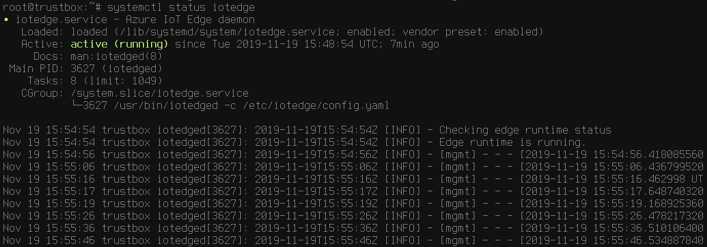

Scalys TrustBox system Azure IoT Edge Service with running Ubuntu 18.04
===
---

# Table of Contents

-   [Introduction](#Introduction)
-   [Step 1: Prerequisites](#Prerequisites)
-   [Step 2: Prepare your Device](#PrepareDevice)
-   [Step 3: Manual Test for Azure IoT Edge on device](#Manual)
-   [Step 4: Next Steps](#NextSteps)
-   [Step 5: Troubleshooting](#Step-5-Troubleshooting)

# Introduction

**About this document**

This document describes how to connect TrustBox device running Ubuntu 18.04 with Azure IoT Edge Runtime pre-installed and Device Management. This multi-step process includes:

-   Configuring Azure IoT Hub
-   Registering your IoT device
-   Build and Deploy client component to test device management capability 

# Step 1: Prerequisites

You should have the following items ready before beginning the process:

-   [Prepare your development environment](https://scalys.com/wp-content/uploads/TrustBox_Edge_Quick_Start_Guide.pdf)
-   [Setup your IoT hub](https://account.windowsazure.com/signup?offer=ms-azr-0044p)
-   [Provision your device and get its credentials][lnk-manage-iot-hub]
-   [Sign up to IOT Hub](https://account.windowsazure.com/signup?offer=ms-azr-0044p)
-   [Add the Edge Device](https://docs.microsoft.com/en-us/azure/iot-edge/quickstart-linux)
-   [Add the Edge Modules](https://docs.microsoft.com/en-us/azure/iot-edge/quickstart-linux#deploy-a-module)
-   TrustBox device
-   Any necessary connectivity cables (e.g. Ethernet, microUSB)

# Step 2: Prepare your Device

TrustBox comes with Ubuntu OS pre-installed. Follow the [Quick Start](https://scalys.com/wp-content/uploads/TrustBox_Edge_Quick_Start_Guide.pdf) instructions to start boot TrustBox and configure either wireless or wired network.

## 2.1 Update iotedge

Update the iotedge on the device to the latest available release:

    sed -i 's/1.0.8-rc1/1.0/' /etc/iotedge/config.yaml
    curl https://packages.microsoft.com/keys/microsoft.asc | sudo apt-key add -
    echo "deb https://packages.microsoft.com/ubuntu/18.04/multiarch/prod bionic main" >> /etc/apt/sources.list
    apt update
    apt install iotedge
    
## 2.2 Configure iotedge

Configure iotedge with connection string:

    perl -ne 's/(?<=device_connection_string: ")[^"]*/<PUT YOUR CONNECTION STRING HERE>/g; print;' -i /etc/iotedge/config.yaml

or by editing /etc/iotedge/config.yaml manually.

Restart the iotedge:

    systemctl restart iotedge

# Step 3: Manual Test for Azure IoT Edge on device

This section walks you through the test to be performed on the Edge devices running the Linux operating system such that it can qualify for Azure IoT Edge certification.

## 3.1 Edge RuntimeEnabled (Mandatory)

**Details of the requirement:**

The following components come pre-installed with the default TrustBox firmware:

-   Azure IoT Edge Security Daemon
-   Daemon configuration file
-   Moby container management system
-   A version of `hsmlib`

*Edge Runtime Enabled:*

**Check the iotedge daemon command:** 

Open the command prompt on your IoT Edge device, confirm that the Azure IoT edge Daemon is under running state

    systemctl status iotedge

  

Open the command prompt on your IoT Edge device, confirm that the module deployed from the cloud is running on your IoT Edge device

    iotedge list

  

On the device details page of the Azure, you should see the runtime modules - edgeAgent, edgeHub and tempSensor modueles are under running status

 

# Step 4: Troubleshooting

Please contact [Scalys](https://scalys.com) for help with troubleshooting.
  
[setup-devbox-linux]: https://github.com/Azure/azure-iot-sdk-c/blob/master/doc/devbox_setup.md
[lnk-setup-iot-hub]: ../setup_iothub.md
[lnk-manage-iot-hub]: ../manage_iot_hub.md
